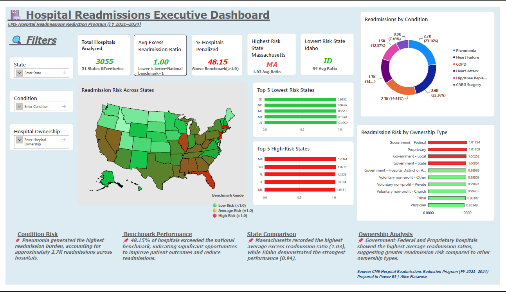

#  Hospital Readmissions Executive Dashboard

## Dashboard Preview

## Project Overview

This Power BI project analyzes hospital readmission performance across 3,055 hospitals in 51 U.S. states and territories using CMS Hospital Readmissions Reduction Program (HRRP) data.

The dashboard was developed to identify readmission risk patterns, compare hospital ownership performance, evaluate geographic trends, and highlight opportunities for healthcare quality improvement.

---

## Business Problem

Hospital readmissions remain a major healthcare quality and cost challenge. This project answers the following questions:

* Which states have the highest and lowest readmission risk?
* Which medical conditions drive the largest readmission burden?
* How does hospital ownership influence readmission performance?
* How many hospitals exceed the national benchmark?
---
## Key Insights

* **48.15%** of hospitals exceeded the national readmission benchmark.
* **Pneumonia** generated the highest readmission burden (2.7K readmissions).
* **Massachusetts** recorded the highest average excess readmission ratio (1.03).
* **Idaho** recorded the lowest average excess readmission ratio (0.94).
* Government-Federal and Proprietary hospitals showed the highest readmission risk.
---
## Dashboard Features

* Executive KPI Summary
* Geographic Risk Analysis
* Top 5 Highest-Risk States
* Top 5 Lowest-Risk States
* Readmission Analysis by Condition
* Ownership Performance Analysis
* Interactive Filters and Slicers
---
## Tools & Technologies

* Power BI
* DAX
* Microsoft Excel
* CMS Hospital Readmissions Reduction Program (HRRP) Dataset
---
## Skills Demonstrated

* Data Visualization
* Dashboard Development
* Healthcare Analytics
* DAX Measures
* KPI Design
* Geographic Analysis
* Executive Reporting
* Data Storytelling
---
## Author
**Alice Shingirirai Mataruse**
LinkedIn: https://www.linkedin.com/in/alice-mataruse
